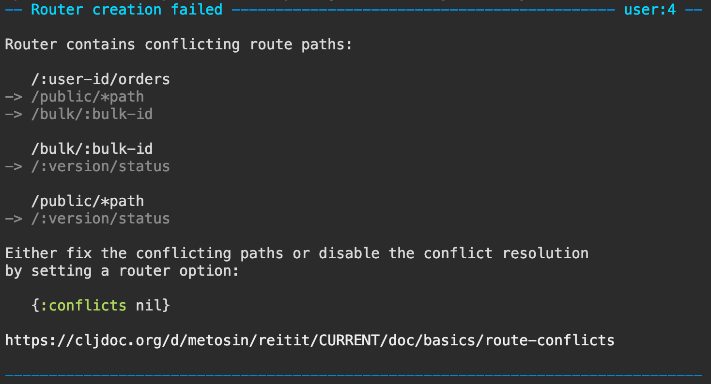

# Error Messages

All exceptions thrown in router creation are caught, formatted and rethrown by the `reitit.core/router` function. Exception formatting is done by the exception formatter defined by the `:exception` router option.

## Default Errors

The default exception formatting uses `reitit.exception/exception`. It produces single-color, partly human-readable, error messages.

```clj
(require '[reitit.core :as r])

(r/router
  [["/ping"]
   ["/:user-id/orders"]
   ["/bulk/:bulk-id"]
   ["/public/*path"]
   ["/:version/status"]])
```


## Pretty Errors

```clj
[metosin/reitit-dev "0.5.5"]
```

For human-readable and developer-friendly exception messages, there is `reitit.dev.pretty/exception` (in the `reitit-dev` module). It is inspired by the lovely errors messages of [ELM](https://elm-lang.org/blog/compiler-errors-for-humans) and [ETA](https://twitter.com/jyothsnasrin/status/1037703436043603968) and uses [fipp](https://github.com/brandonbloom/fipp), [expound](https://github.com/bhb/expound) and [spell-spec](https://github.com/bhauman/spell-spec) for most of heavy lifting.

```clj
(require '[reitit.dev.pretty :as pretty])

(r/router
  [["/ping"]
   ["/:user-id/orders"]
   ["/bulk/:bulk-id"]
   ["/public/*path"]
   ["/:version/status"]]
  {:exception pretty/exception})
```



## Extending

Behind the scenes, both error formatters are backed by a multimethod, so they are easy to extend.

## More examples

See the [validating route data](route_data_validation.md) page.

## Runtime Exception

See [Exception Handling with Ring](exceptions.md).
