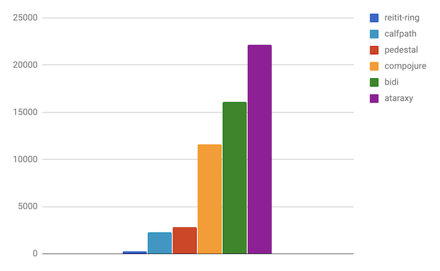
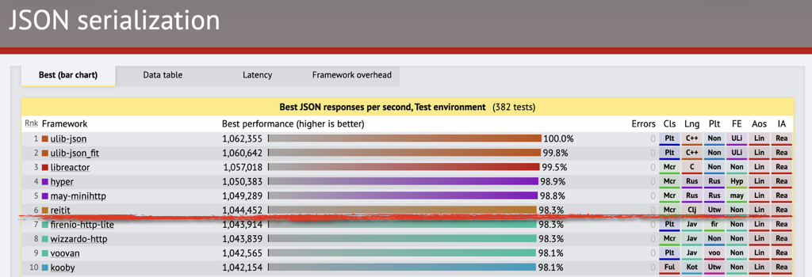

# Performance

Reitit tries to be really, really fast.



### Rationale

* Multiple routing algorithms, chosen based on the route tree
* Route flattening and re-ordering
* Managed mutability over immutability
* Precompute/compile as much as possible (matches, middleware, interceptors, routes, path-parameter sets)
* Use abstractions that enable JVM optimizations
* Use small functions to enable JVM Inlining
* Use Java where needed
* Protocols over Multimethods
* Records over Maps
* Always be measuring
* Don't trust the (micro-)benchmarks

### Does routing performance matter?

Well, it depends. With small route trees, it might not. But, with large (real-life) route trees, difference between the fastest and the slowest tested libs can be two or three orders of magnitude. For busy sites it actually matters if you routing request takes 100 ns or 100 µs. A lot.

### TechEmpower Web Framework Benchmarks

Reitit + [jsonista](https://github.com/metosin/jsonista) + [pohjavirta](https://github.com/metosin/pohjavirta) is one of the fastest JSON api stacks in the tests. See full results [here](https://www.techempower.com/benchmarks/#section=test&runid=42f65a64-69b2-400d-b24e-20ecec9848bc&hw=ph&test=json).



### Tests

All perf tests are found in [the repo](https://github.com/metosin/reitit/tree/master/perf-test/clj/reitit) and have been run with the following setup:

```
;;
;; start repl with `lein perf repl`
;; perf measured with the following setup:
;;
;; Model Name:            MacBook Pro
;; Model Identifier:      MacBookPro11,3
;; Processor Name:        Intel Core i7
;; Processor Speed:       2,5 GHz
;; Number of Processors:  1
;; Total Number of Cores: 4
;; L2 Cache (per Core):   256 KB
;; L3 Cache:              6 MB
;; Memory:                16 GB
;;
```

**NOTE:** Tests are not scientific proof and may contain errors. You should always run the perf tests with your own (real-life) routing tables to get more accurate results for your use case. Also, if you have idea how to test things better, please let us know.

### Simple Example

The routing sample taken from [bide](https://github.com/funcool/bide) README:

```clj
(require '[reitit.core :as r])
(require '[criterium.core :as cc])

(def routes
  (r/router
    [["/auth/login" :auth/login]
     ["/auth/recovery/token/:token" :auth/recovery]
     ["/workspace/:project/:page" :workspace/page]]))

;; Execution time mean (per 1000) : 3.2 µs -> 312M ops/sec
(cc/quick-bench
  (dotimes [_ 1000]
    (r/match-by-path routes "/auth/login")))

;; Execution time mean (per 1000): 115 µs -> 8.7M ops/sec
(cc/quick-bench
  (dotimes [_ 1000]
    (r/match-by-path routes "/workspace/1/1")))
```

Based on the [perf tests](https://github.com/metosin/reitit/tree/master/perf-test/clj/reitit/perf/bide_perf_test.clj), the first (static path) lookup is 300-500x faster and the second (wildcard path) lookup is 18-110x faster that the other tested routing libs (Ataraxy, Bidi, Compojure and Pedestal).

But, the example is too simple for any real benchmark. Also, some of the libraries always match on the `:request-method` too and by doing so, do more work than just match by path. Compojure does most work also by invoking the handler.

So, we need to test something more realistic.

### RESTful apis

To get better view on the real life routing performance, there is [test](https://github.com/metosin/reitit/blob/master/perf-test/clj/reitit/opensensors_perf_test.clj) of a mid-size rest(ish) http api with 50+ routes, having a lot of path parameters. The route definitions are pulled off from the [OpenSensors](https://opensensors.io/) swagger definitions.

Thanks to the snappy [Wildcard  Trie](https://github.com/metosin/reitit/blob/master/modules/reitit-core/java-src/reitit/Trie.java) (a modification of [Radix Tree](https://en.wikipedia.org/wiki/Radix_tree)), `reitit-ring` is fastest here. [Calfpath](https://github.com/kumarshantanu/calfpath) and [Pedestal](https://github.com/pedestal/pedestal) are also quite fast.


### CQRS apis

Another real-life [test scenario](https://github.com/metosin/reitit/blob/master/perf-test/clj/reitit/lupapiste_perf_test.clj) is a [CQRS](https://martinfowler.com/bliki/CQRS.html) style route tree, where all the paths are static, e.g. `/api/command/add-order`. The 300 route definitions are pulled out from [Lupapiste](https://github.com/lupapiste/lupapiste).

Both `reitit-ring` and Pedestal shine in this test, thanks to the fast lookup-routers. On average, they are **two** and on best case, **three orders of magnitude faster** than the other tested libs. Ataraxy failed this test on `Method code too large!` error.


**NOTE**: in real life, there are usually always also wild-card routes present. In this case, Pedestal would fallback from lookup-router to the prefix-tree router, which is order of magnitude slower (30x in this test). Reitit would handle this nicely thanks to it's `:mixed-router`: all static routes would still be served with `:lookup-router`, just the wildcard routes with `:segment-tree`. The performance would not notably degrade.

### Path conflicts

**TODO**

### Why measure?

The reitit routing perf is measured to get an internal baseline to optimize against. We also want to ensure that new features don't regress the performance. Perf tests should be run in a stable CI environment. Help welcome!

### Looking out of the box

A quick poke to [the fast routers in Go](https://github.com/julienschmidt/go-http-routing-benchmark) indicates that reitit is less than 50% slower than the fastest routers in Go. Which is kinda awesome.

### Faster!

By default, `reitit.ring/ring-router`, `reitit.http/ring-router` and `reitit.http/routing-interceptor` inject both `Match` and `Router` into the request. You can remove the injections setting options `:inject-match?` and `:inject-router?` to `false`. This saves some tens of nanos (with the hw described above).

```clj
(require '[reitit.ring :as ring])
(require '[criterium.core :as cc])

(defn create [options]
  (ring/ring-handler
    (ring/router
      ["/ping" (constantly {:status 200, :body "ok"})])
    (ring/create-default-handler)
    options))

;; 130ns
(let [app (create nil)]
  (cc/quick-bench
    (app {:request-method :get, :uri "/ping"})))

;; 80ns
(let [app (create {:inject-router? false, :inject-match? false})]
  (cc/quick-bench
    (app {:request-method :get, :uri "/ping"})))
```

**NOTE**: Without `Router`, you can't to do [reverse routing](ring/reverse_routing.md) and without `Match` you can't write [dynamic extensions](ring/dynamic_extensions.md).

### Performance tips

Few things that have an effect on performance:

* Wildcard-routes are an order of magnitude slower than static routes
* Conflicting routes are served with LinearRouter, which is the slowest implementation.
* It's ok to mix non-wildcard, wildcard or even conflicting routes in a same routing tree. Reitit will create an hierarchy of routers to serve all the routes with best possible implementation. 
* Move computation from request processing time into creation time, using by compiling [middleware](ring/compiling_middleware.md), [interceptors](http/interceptors.md) and [route data](advanced/configuring_routers.md).
  * Unmounted middleware (or interceptor) is infinitely faster than a mounted one effectively doing nothing.
